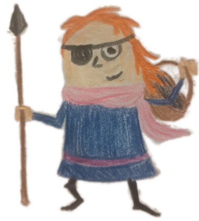
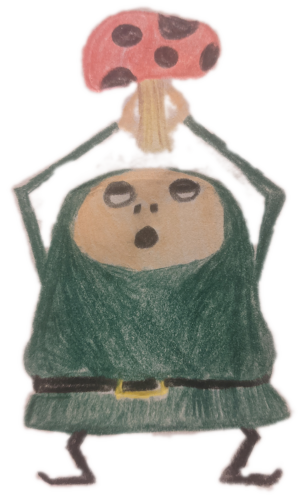
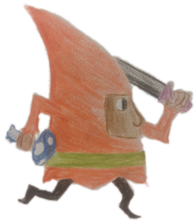
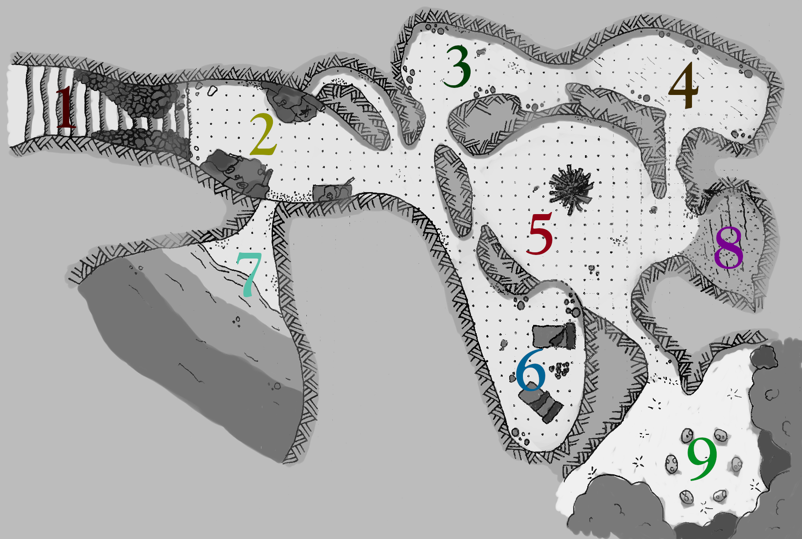

The following is a mushroom foraging dungeon delve for 3-5
adventurers. It is a hack of [*Tunnel Mycologists of the Far
Realms*](https://derekkinsman.itch.io/tunnel-mycologists-of-the-far-realms),
which is itself a hack of [*Tunnel
Goons*](https://tunnelgoons.com/). it is designed to be run using the
book [*Fungi of the Far
Realms*](https://melsonian-arts-council.itch.io/fungi-of-the-far-realms),
and references it extensively.

If you like what I’m doing, why not [buy a copy on
Itch](https://tsvallender.itch.io/fungi) or [support me on
Ko-fi](https://ko-fi.com/tsvallender)?

## Resources

* [You can buy a PDF of the adventure on Itch!](https://tsvallender.itch.io/fungi)
* [PDF character sheet](/dungeons/fungi/charactersheet.pdf)
* [PDF mushroom tracker](tracker.pdf)
* [Digital character sheet](https://tsvallender.co.uk/sheets/fungi)
* [Full size map](fungi.jpg)
* [Full size map without labels](fungi-nolabels.jpg)

## Fungal Furrow

You hail from a small village on the outskirts of a dank wood in a
valley known as Fungal Furrow. Those few who know of this village
outside its borders know it only as a source of fine mushrooms,
whether edible, magical, medicinal or… for other purposes. Recently
there have been rumours that a species of fungi long thought lost has
once more been found in the area. Cloaked children have been rumoured
around the village at night, seen scurrying off towards the nearby
caves - caves that are avoided by the superstitious villagers as the
mythical tomb of a giant. You gather now to find the truth in these
rumours and put your mycological expertise to the test.

## Ask your players

A different player should provide each piece of information:
* The forgotten fungi's properties
* The forgotten fungi’s name
* The village's name

Every player should provide:
* A detail about themselves everyone knows
* A detail about themselves few know
* Why do they want to find the mushrooms - money, fame, science, need for its properties?

## The People of the Endless Fungus

The People of the Endless Fungus are two goblinesque creatures, draped
in long cloaks. These are the creatures which have been mistaken by
the villagers for children while scavenging the village for
supplies. They have evolved to live underground, with independently
moving ears as large as their face, a snout with two large nostrils
and tiny eyes which lay inset behind small sphincters.

They worship the Endless Fungus, believing it to be the largest
organism in the world, and the wisest. They seek its fruits, in order
to ingest them and discover its truths. They believe (rightly or
wrongly) that the mushrooms the adventurers seek are a part of the
Endless Fungus. They wish to claim them for themselves and their
people, and will protect them from the adventurers

If the adventurers make any relatively loud noises, the People of the
Endless Fungus will begin following them, and may be spotted doing
so. Otherwise, determine randomly where the party comes upon
them. They will only attack if physically threatened or to protect the
Forgotten Fungus.

## Rules

The GM describes the world to the adventurers, who then describe how
their characters act.

**Action roll:** If an action’s success is uncertain, the adventurer
rolls 2d6 + a relevant class modifier and a point for any relevant
item. If the total equals or exceeds the task’s Difficulty Rating
(DR), the task succeeds.

*Easy: 8, Moderate: 10, Hard: 12*

**Damage:** For a task that could result in taking or dealing damage
(such as combat), the amount of damage taken or dealt is the amount
the task's difficulty is missed or exceeded by. Adventurers die if
their HP reaches zero; determine the fungus that grows on their
corpse.

**Inventory:** The number of items you may carry easily is determined
by your Inventory Score. Each extra item you carry reduces all
Action Rolls by 1.

**Healing:** Lost HP are regained with a safe night’s rest, by consuming
certain fungi or with a first aid kit.

**Advancement:** When the GM determines an appropriate time to level up,
an adventurer adds 1 to a class score and either their HP or Inventory
Score.

**Character creation:** Name your adventurer. Gain 10 HP. Inventory
score is 6. Distribute three points between classes and choose three
starting items.

**Classes:**
* **Mycologist:** Identification of mushrooms
* **Mycotoxicologist:** Identifying and curing of poisons
* **Brute:** Hitting things, strength

**Starting items:** - Scientific toolset (2 slots) - Camping supplies
(2 slots) - Torch - Mushroom basket (holds 12 mushrooms) - 1 day’s
rations - Journal & pen - Trowel - Thick gloves - Specimen carry
case - First aid kit (2 uses, regain 1 HP) - Lamp - Scissors -
Mortar & Pestle

## Identifying & selling mushrooms

Rarities for fungi mentioned are given as a DR (Difficulty Rating) in
parentheses after the name, others should be secretly determined by
the GM. Also given is the relevant page number to find the mushroom in
*Fungi of the Far Realms*.

All players who are attempting the identification roll a combined
Mycologist check, adding their results together. If they succeed, they
correctly identify the mushroom. If they exceed the difficulty by 2 or
more, they recall all known details about the fungus. If they miss by
3 or more, they misidentify the fungus. If they correctly “identify” a
new to science fungus, they can infer its properties based on their
mycological expertise.

When the adventurers return to the village they can sell the mushrooms
they have collected. Mushrooms must be sold to the correct buyer -
edible mushrooms, poisonous mushrooms and psychoactive mushrooms, for
example, each have very different markets. Thus money is lost for each
misidentified mushroom and gained for each correctly identified one,
according to the table below.

| Rarity         | DR    | Price (per mushroom) |
|  :-----------: | :---: | :------------------: |
| Common         | 5–7   | 1                    |
| Uncommon       | 8–13  | 10                   |
| Rare           | 13–15 | 100                  |
| New to science | 15+   | 500                  |

## The Forgotten Fungi

The Forgotten Fungi is present in one cave only. On entering a new
cave, the GM rolls d666:

* For the first two caves, if you roll three 6s, the Forgotten Fungi
  is present here.
* For caves three and four, if you roll two or more 6s, the Forgotten
  Fungi is present here.
* For cave five, if you roll one or more 6s, the Forgotten Fungi is
  present here.
* If the adventurers reach the final cave and you have yet to
  determine the location of the Forgotten Fungi, it is here.

Regardless of whether the cave contains the Forgotten Fungi, use your
roll to determine a cluster of mushrooms growing visibly in the
room. (Feel free to add more at your discretion).

The Forgotten Fungi is DR 15 to identify with certainty, but is too
unique to be misidentified.

## The Caves of Fungal Furrow

<a href="javascript:void(0);" class="unstick" id="unstick">X</a>

<h3 id="stairway">1. Stairway</h3>

*A series of broad, worn steps lead down into the darkness. There are
 piles of rubble scattered about where collapse has occurred,
 increasing as you descend until you have to continue single file
 between the rubble.*

* There is moss and lichen growing on the rubble, and d4 *Cunny Trumpet
  (p226, DR 14)* growing among them.

<h3 id="offerings">2. Offerings</h3>

*Piles of refuse lie scattered about the room. A damp, musty smell
 permeates the air. Something moves among the heaps. Rats?*

* The refuse piles were once offerings to the giant who lies in these
  caves. Searching them finds the occasional semi-valuable trinket but
  also disturbs the rats who call them home.
* There are also d4 *Snake’s Tomb (p563, DR 18)* here, at the very bottom
  of the piles.
* The d3 rats (DR 8, 4 HP) are infested with *Funnybug Fungus (p266, DR
  20)* and are unusually violent due to their hunger.

<h3 id="side-room">3. Side Room</h3>

*The passageway widens here, and across the walls you see the remains
 of ancient cave paintings.*

* The paintings depict rings of people prostrating themselves around a
giant toadstool, the consumption of rats and rings of mushrooms with
a fire at the centre.

<h3 id="the-root-room">4. The Root Room</h3>

*Roots drape from the ceiling here, casting unnerving shadows about
 the room.*

* Tree roots penetrate the ceiling here. A faint luminescence betrays
  the presence of d4 *Aurora Bracket (p124, DR 13)*.
* d6 *Psygoblin Mushroom (p514, DR 15)* grow about the edges of the room.

<h3 id="tomb">5. Tomb</h3>

*Immediately you see the immense skeleton here, animated by some
 unknown magic; the giant whose tomb you disturb? Its body is lit from
 beneath by a low campfire over which it squats. As your eyes adjust
 you notice a cauldron lashed with rusting chains to its bones where
 its belly once was; something bubbles inside as the creature holds it
 in the flame.*

* There is an opening on the eastern wall, a window into area 6.
* The skeleton (DR 10, 8 HP) is content and distracted, humming
  softly. It will only immediately notice the adventurers if they walk
  straight in without looking, or have been making loud noises nearby.
* If they stop and watch the skeleton, they see it periodically stand
  and pluck mushrooms from the cave roof, dropping them through its
  mouth into the cauldron where it is making a soup. The People of the
  Endless Fungus have been bringing it mushrooms in return for soup.
* The mushrooms on the roof are *Pauper’s Saviour (p461, DR 6)* but are
  out of the adventurers’ reach
* If the skeleton notices the adventurers, it slowly rises, murmuring
  “meat” and attempts to add them to its soup. It can be persuaded
  otherwise with fungal offerings.

<h3 id="camp">6. Camp</h3>

*There are two bedrolls here. Between them lie a pile of common
 mushrooms.*

* A window here overlooks area 5.
* The common mushrooms are *Pauper’s Saviour, (p461, DR 6)*.
* In the corners of the room grow clusters of *Goblin’s Banquet (p315, DR 15)*.

<h3 id="lake">7. Lake</h3>

*The cave opens into a suddenly vast area, stretching off into the
  distance. Any meager light you have cannot show you the limits of
  this space. A few paces in front of you, the floor falls away and an
  apparently endless underground lake faces you. And occasional plop
  and splash echoes around the cave.*

* Bubbles here indicate the presence of d12 *Farting Fairy (p253, DR
  10)*.
* More deeply hidden are d6 *Aquatic Chanterelle (p123, DR 11)*.

<h3 id="the-mushroom-garden">8. The Mushroom Garden</h3>

*This ground in this small area seems to be soil rather than the stone
 present throughout the rest of the caves. It looks like it has
 tended; the earth is unusually flat and a crude stone trowel lays in
 one corner.*

* The earth has clearly been disturbed here. Just beneath the ground
  is a mushroom garden tended by the People of the Endless Fungus.
* If investigated and dug up, the adventurers find d6 *Agaric Rex (p112,
  DR 7)*.
* If the adventurers step on the area without investigating first,
  they fall up to their waist into the garden, crushing the mushrooms.

<h3 id="fairy-circle">9. Fairy Circle</h3>

*You emerge into the wood, the cool air pleasant on your skin. In a
 clearing in front of you a ring of toadstools stands conspicuously.*

* There are d4 rabbits here with *Fungiflesh (p265, DR 6)* growing from
  their backs. They scatter unless approached with utmost caution (DR
  11).
* If the adventurers attempt to harvest mushrooms here, they are
  attacked by d12 fairies (DR 9, 4 HP). They are scared of fire, avoid
  adventurers with torches and flee if larger fires are lit.
* If the adventurers decide to explore the wood further, randomly
  determine any mushrooms they may find, but make it clear their main
  quarry lies in the caves.

## Acknowledgements
This is a hack of Derek Kinsman’s [*Tunnel Mycologists of the Far
Realms*](https://derekkinsman.itch.io/tunnel-mycologists-of-the-far-realms),
which is itself a hack of [*Tunnel
Goons*](https://tunnelgoons.com/).

[*Fungi of the Far
Realms*](https://melsonian-arts-council.itch.io/fungi-of-the-far-realms)
is written by Alex Clements and published by the Melsonian Arts
Council. Fungi Forricking in Fungal Furrow is an independent
publication by T S Vallender and is not affiliated with the Melsonian
Arts Council.

The skeleton was inspired by Map Crow's excellent video [*Building Better
Skeletons*](https://www.youtube.com/watch?v=AYuR-x7AuYE).

Fonts used are *Raleway* and *Goudy Bookletter* by the wonderful
[*League of Moveable Type*](https://theleagueofmoveabletype.com).